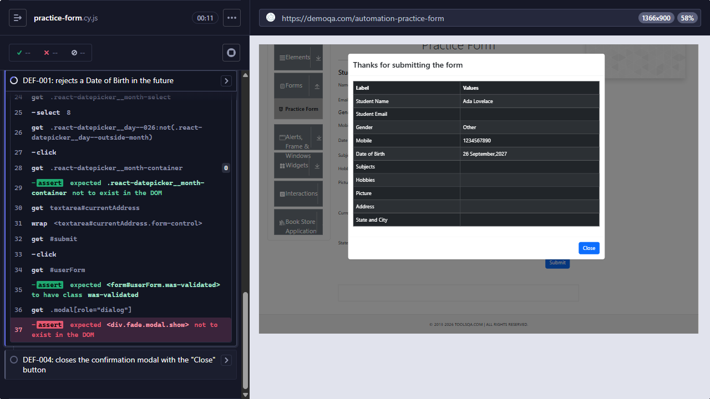

# [DEF-001] Practice Form accepts a future Date of Birth and defaults it to today

**Labels:** `bug` `severity:medium` `priority:medium` `area:practice-form`

## Summary

The Date of Birth datepicker on the Practice Form lets the user select a date in the future, and the form is
submitted with it. This registers a student who has not been born yet. The field also defaults to today's date, so a
user who never opens the datepicker submits "today" as the birth date without noticing.

## Environment

- URL: https://demoqa.com/automation-practice-form
- Runner: Cypress 15.21.1, Electron 138 (headless), viewport 1366×900
- First observed: 2026-09-26 · Reconfirmed: 2026-09-28 (`npm run test:known-defects`)

## Preconditions

None.

## Steps to reproduce

1. Open `https://demoqa.com/automation-practice-form`.
2. Fill in the required fields (First Name, Last Name, Gender, Mobile `1234567890`).
3. Open **Date of Birth** and select a date one year in the future.
4. Click **Submit**.

## Expected result

Future dates cannot be selected in the datepicker, or submitting shows a validation error on Date of Birth and the
confirmation modal does not open.

## Actual result

The form is submitted with no validation error, and the confirmation modal ("Thanks for submitting the form") lists
the future date as the student's Date of Birth.

## Severity / Priority

- **Severity:** Medium. Invalid data (a student not born yet) is accepted and "registered". The default of today's
  date makes it worse, because most users never change it.
- **Priority:** Medium. The fix is simple (`maxDate` on the datepicker plus a check on submit), and the defect
  does not block the main flow.

## Reproducibility

Always. The automated test failed on every recorded run of `npm run test:known-defects`.

## Evidence



- Screenshot: `docs/evidence/DEF-001-future-date-of-birth.png`. The confirmation modal shows
  "Date of Birth: 26 September,2027" for a run on 2026-09-26.
- Automated check: `cypress/e2e/forms/practice-form.cy.js` → "DEF-001: rejects a Date of Birth in the future"
- Failure output:

```
AssertionError: Timed out retrying after 8000ms: Expected <div.fade.modal.show> not to exist in the DOM, but it was continuously found.
    at Modal.shouldBeClosed (cypress/pages/components/Modal.js)
    at PracticeFormPage.shouldNotBeSubmitted (cypress/pages/PracticeFormPage.js)
```

## Workaround

None. Nothing on the page prevents a future date from being submitted.

## Notes / suspected cause

Hypothesis: the react-datepicker is not configured with `maxDate`, and there is no check on submit that compares
Date of Birth with the current date.

## Suggested fix / acceptance criteria

- [ ] The Date of Birth datepicker does not allow selecting any date after today (`maxDate` = today).
- [ ] Submitting a Date of Birth later than today shows a visible validation error, and the confirmation modal does
      not open.
