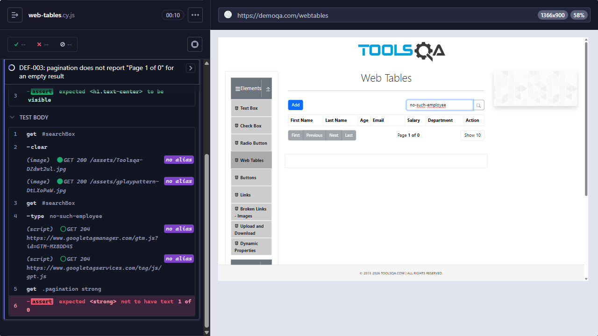

# [DEF-003] Web Tables shows "Page 1 of 0" and no empty-state message for a search with no results

**Labels:** `bug` `severity:low` `priority:low` `area:web-tables` · **Issue:** [#3](https://github.com/felipe-haro/demoqa-cypress-automation/issues/3)

## Summary

When a search in Web Tables has no matches, the table body is empty and shows no message. The pagination also shows
"Page 1 of 0", which is not possible.

## Environment

- URL: https://demoqa.com/webtables
- Runner: Cypress 15.21.1, Electron 138 (headless), viewport 1366×900
- First observed: 2026-09-26 · Reconfirmed: 2026-09-28 (`npm run test:known-defects`)

## Preconditions

None.

## Steps to reproduce

1. Open `https://demoqa.com/webtables`.
2. Type `no-such-employee` in the search box.

## Expected result

The table body shows an empty-state message such as "No rows found", and the pagination reads "Page 1 of 1" or
is hidden.

## Actual result

The table body is empty with no message, and the pagination reads **"Page 1 of 0"**.

## Severity / Priority

- **Severity:** Low. This is a cosmetic/UX problem, and no data is lost or corrupted.
- **Priority:** Low. There is no functional impact, and the fix is simple.

## Reproducibility

Always. The automated test failed on every recorded run of `npm run test:known-defects`.

## Evidence

- Screenshot: `docs/evidence/DEF-003-page-1-of-0.png`. The table after searching `no-such-employee`: the body is
  empty and the pagination reads "Page 1 of 0". The Cypress command log shows the failed assertion
  `expected <strong> not to have text 1 of 0`.
- Automated check: `cypress/e2e/elements/web-tables.cy.js` → "DEF-003: pagination does not report "Page 1 of 0"
  for an empty result"
- Failure output: `Timed out retrying after 8000ms`. The plain-text log omits the compared values, but the command
  log in the screenshot shows them.

## Workaround

None needed. The problem is only visual.

## Notes / suspected cause

Hypothesis: the pagination calculates the total number of pages as `rows / pageSize` without a minimum of 1, and no
empty-state component is shown when the filtered result is empty.

## Suggested fix / acceptance criteria

- [ ] The pagination never shows "Page 1 of 0". For an empty result, it shows "Page 1 of 1" or is hidden.
- [ ] The table body shows an empty-state message (e.g. "No rows found") when a search returns no results.
