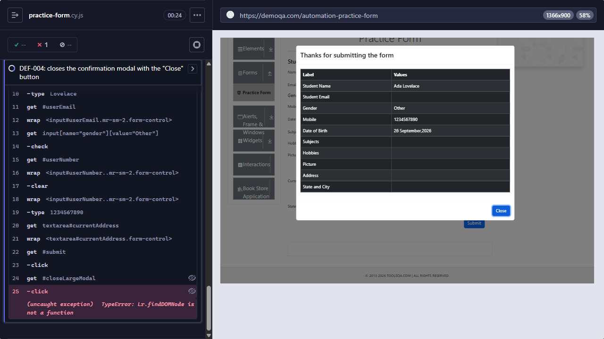

# [DEF-004] Practice Form confirmation modal: "Close" button throws a TypeError and the modal stays open

**Labels:** `bug` `severity:high` `priority:high` `area:practice-form`

## Summary

After the user submits the Practice Form, clicking the **Close** button of the "Thanks for submitting the form" modal
throws an uncaught JavaScript exception, and the modal does not close. Every user who tries to dismiss the result
with the button is stuck on the confirmation screen.

## Environment

- URL: https://demoqa.com/automation-practice-form
- Runner: Cypress 15.21.1, Electron 138 (headless), viewport 1366×900
- First observed: 2026-09-26 · Reconfirmed: 2026-09-28 (`npm run test:known-defects`)

## Preconditions

None.

## Steps to reproduce

1. Open `https://demoqa.com/automation-practice-form`.
2. Fill in First Name `Ada`, Last Name `Lovelace`, Gender `Other`, Mobile `1234567890`.
3. Click **Submit**. The "Thanks for submitting the form" modal opens.
4. Click the **Close** button at the bottom of the modal.

## Expected result

The modal closes and the user is back on the form.

## Actual result

Nothing visible happens, and the modal stays open. The browser reports an uncaught exception:

```
TypeError: Lr.findDOMNode is not a function
    at onClick (https://demoqa.com/assets/index-D_rDx8ml.js:36:57250)
```

## Severity / Priority

- **Severity:** High. The main control to dismiss the result of the page's primary flow is broken, and it throws an
  unhandled exception.
- **Priority:** High. Every user who submits the form and clicks Close runs into it. A workaround exists (clicking
  outside the modal), but users are unlikely to find it.

## Reproducibility

Always. The automated test failed on every recorded run of `npm run test:known-defects`.

## Evidence



- Screenshot: `docs/evidence/DEF-004-close-button-typeerror.png`. The confirmation modal is still open after the
  click on Close. The Cypress command log shows `(uncaught exception) TypeError: Lr.findDOMNode is not a function` on
  the `click` command.
- Automated check: `cypress/e2e/forms/practice-form.cy.js` → "DEF-004: closes the confirmation modal with the
  "Close" button"
- Failure output:

```
TypeError: The following error originated from your application code, not from Cypress.
  > Lr.findDOMNode is not a function
    at onClick (https://demoqa.com/assets/index-D_rDx8ml.js:36:57250)
```

## Workaround

Clicking the backdrop (outside the modal) closes it without errors. The test suite uses this path in its regular
tests (`practice-form.cy.js`, "dismisses the confirmation modal and keeps the user on the form").

## Notes / suspected cause

Hypothesis based on the error message, not confirmed in the application source: `ReactDOM.findDOMNode` was removed
in React 19, and a dependency used by this button's click handler (probably a transition helper) still calls it. The
modals on `/modal-dialogs` and the Web Tables registration modal close correctly, so the problem seems specific to
this handler.

## Suggested fix / acceptance criteria

- [ ] Clicking the "Close" button closes the confirmation modal.
- [ ] No uncaught exception is reported in the console when the Close button is used.
