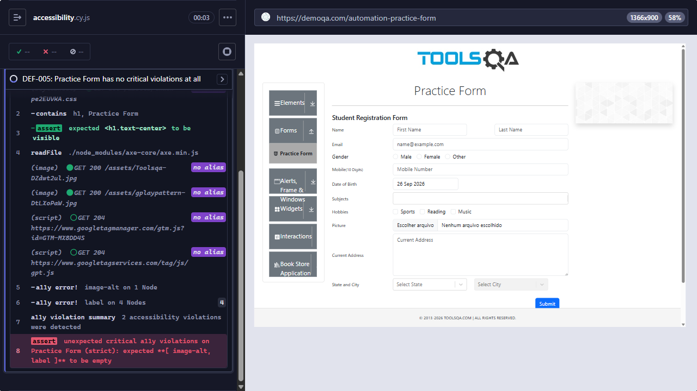

# [DEF-005] Critical accessibility violations: missing labels, alt text and accessible names

**Labels:** `bug` `severity:medium` `priority:medium` `area:accessibility`

## Summary

An axe-core scan of the six tested pages found critical WCAG 2.1 level A violations: an image without `alt`, form
labels that are not associated with their inputs, and controls with no accessible name. As a result, screen-reader
users cannot identify several form fields, selects and buttons.

## Environment

- Pages: Practice Form, Text Box, Web Tables, Select Menu, Alerts and Modal Dialogs on https://demoqa.com
- Runner: Cypress 15.21.1, Electron 138 (headless), axe-core 4.13 (ad containers excluded), viewport 1366×900
- First observed: 2026-09-26 · Reconfirmed: 2026-09-28 (`npm run test:known-defects`)

## Preconditions

None.

## Steps to reproduce

1. Run axe-core on each of the six pages (browser extension, or `npm run test:a11y`).
2. Filter the results to `critical` impact.

## Expected result

No critical violations on any scanned page.

## Actual result

Every page has critical violations:

| Page          | `image-alt` | `label` | `select-name` | `button-name` |
| ------------- | :---------: | :-----: | :-----------: | :-----------: |
| Practice Form |      1      |    4    |               |               |
| Text Box      |      1      |    1    |               |               |
| Web Tables    |      1      |         |       1       |       1       |
| Select Menu   |      1      |    3    |       2       |               |
| Alerts        |      1      |         |               |               |
| Modal Dialogs |      1      |         |               |               |

- `image-alt`: the ToolsQA header logo (`header img`) has no `alt`, on every page.
- `label`: `<label>` elements are not associated with their inputs (no `for` attribute).
- `select-name`: the "Show N rows" select (Web Tables) and the native selects on Select Menu have no accessible name.
- `button-name`: the Web Tables search button contains only an icon and has no accessible text.

## Severity / Priority

- **Severity:** Medium. These are WCAG 2.1 level A failures (1.1.1 Non-text Content, 1.3.1 Info and Relationships,
  4.1.2 Name, Role, Value) that stop screen-reader users from identifying several fields.
- **Priority:** Medium. Most fixes are small markup changes (`for`/`htmlFor`, `alt`, `aria-label`).

## Reproducibility

Always. The strict Practice Form check failed on every recorded run of `npm run test:known-defects`, and the
per-page counts above are printed by the axe check on every run.

## Evidence



- Screenshot: `docs/evidence/DEF-005-a11y-practice-form.png`. The Practice Form with the Cypress command log showing
  `a11y error! image-alt on 1 Node`, `a11y error! label on 4 Nodes` and the failed assertion.
- Automated check: `cypress/e2e/accessibility/accessibility.cy.js` → "DEF-005: Practice Form has no critical
  violations at all"
- Failure output:

```
AssertionError: unexpected critical a11y violations on Practice Form (strict): expected [ 'image-alt', 'label' ] to be empty
```

## Workaround

None for end users. In CI, the violations that are already known are recorded in
`cypress/fixtures/a11yBaseline.json`, so the a11y tests fail only on **new** critical violations.

## Notes / suspected cause

A related markup problem was found while designing selectors: **duplicate `id` attributes**. The Practice Form
uses `id="subjects-label"` for the Subjects, Hobbies and Picture labels, and the Text Box page uses
`id="currentAddress"` for both the textarea and the output line. This was observed in the DOM. It is not one of the
axe rules counted in the table above.

## Suggested fix / acceptance criteria

- [ ] Every `<label>` is associated with its input (`for`/`id`, or `aria-labelledby`).
- [ ] The header logo has a meaningful `alt` (or `alt=""` if it is decorative).
- [ ] Native `<select>` elements expose an accessible name.
- [ ] Icon-only buttons (e.g. the Web Tables search button) expose an accessible name.
- [ ] `id` attributes are unique on each page.
- [ ] axe-core reports zero critical violations on all six pages.
