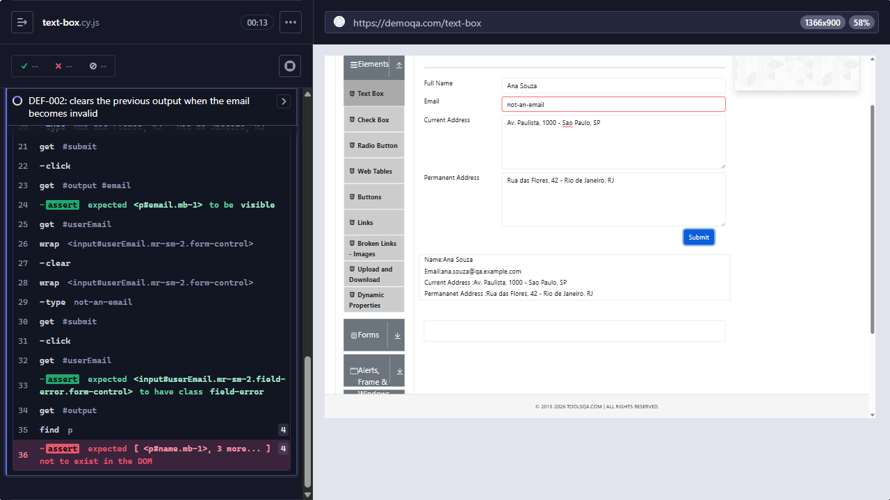

# [DEF-006] Typos in user-facing text: "Permananet" and "Voilet"

**Labels:** `bug` `severity:low` `priority:low` `area:multiple`

## Summary

Two spelling mistakes appear in text that users see: the "Permanent Address" line of the Text Box output, and one
option of the Select Menu "Old Style Select Menu".

## Environment

- URLs: https://demoqa.com/text-box and https://demoqa.com/select-menu
- Observed by DOM inspection during the Cypress work (Cypress 15.21.1, Electron 138), on 2026-09-26

## Preconditions

None.

## Steps to reproduce

1. **Text Box:** open `https://demoqa.com/text-box`, fill in any addresses and click **Submit**. Read the output
   panel.
2. **Select Menu:** open `https://demoqa.com/select-menu` and open the "Old Style Select Menu" dropdown. Read the
   8th option.

## Expected result

1. The output line reads "Permanent Address:".
2. The option reads "Violet".

## Actual result

1. The output reads `Permananet Address :` (DOM: `
Permananet Address :…
`).
2. The option reads `Voilet` (DOM: `<option value="7">Voilet</option>`).

## Severity / Priority

- **Severity:** Low. The problem is only cosmetic, but it is in text that users read.
- **Priority:** Low

## Reproducibility

Always (static text). No automated test covers this defect. It is the only defect in the report without a
`@known-defect` test.

## Evidence

- There is no dedicated screenshot. The DEF-002 screenshot (`docs/evidence/DEF-002-stale-output.png`) also shows the
  "Permananet Address :" text in the output panel.
- DOM snippets: `
Permananet Address :…
` and `<option value="7">Voilet</option>`.

## Workaround

Not applicable.

## Notes / suspected cause

These are typos in the source strings. A related spelling mistake that users do not see: the Prompt button id on
`/alerts` is `promtButton`. It leaks into test code, and the page object hides it behind a `promptButton` key
(`cypress/pages/AlertsPage.js`).

## Suggested fix / acceptance criteria

- [ ] The Text Box output line reads "Permanent Address:".
- [ ] The 8th option of the Select Menu "Old Style Select Menu" reads "Violet".
