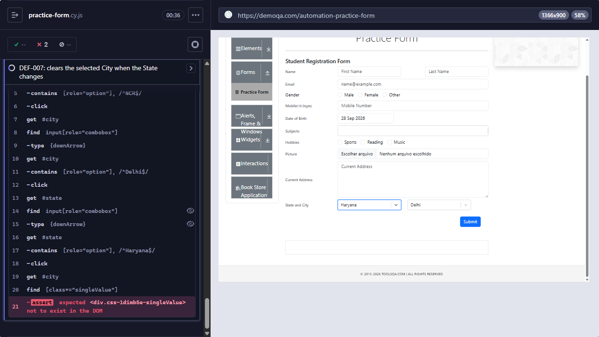

# [DEF-007] Practice Form keeps the old City after the State changes and submits an invalid pair

**Labels:** `bug` `severity:medium` `priority:medium` `area:practice-form`

## Summary

On the Practice Form, changing the State after a City was selected does not clear the City. The City dropdown
correctly updates its options for the new State, but the previous City, which does not belong to that State, stays
selected and is submitted.

## Environment

- URL: https://demoqa.com/automation-practice-form
- Runner: Cypress 15.21.1, Electron 138 (headless), viewport 1366×900
- First observed: 2026-09-28 (exploratory probe, then `npm run test:known-defects`)

## Preconditions

A City is already selected for the first State.

## Steps to reproduce

1. Open `https://demoqa.com/automation-practice-form`.
2. Select State **NCR**, then City **Delhi**.
3. Change State to **Haryana**.
4. Fill in the required fields (First Name, Last Name, Gender, Mobile `1234567890`) and click **Submit**.

## Expected result

After step 3, City is cleared, because Delhi does not belong to Haryana. The user has to pick a Haryana city
(Karnal or Panipat) before submitting.

## Actual result

City still shows **Delhi**, although its dropdown now lists only Karnal and Panipat. The confirmation modal shows
State and City as **"Haryana Delhi"**, a combination that does not exist.

## Severity / Priority

- **Severity:** Medium. The form submits a State/City pair that cannot exist, and nothing in the UI shows the
  mismatch.
- **Priority:** Medium. It affects any user who corrects the State after picking a City, and the fix (clear City when
  State changes) is small.

## Reproducibility

Always. The automated test failed on the recorded run of `npm run test:known-defects`.

## Evidence



- Screenshot: `docs/evidence/DEF-007-stale-city-after-state-change.png`. State "Haryana" is selected and City still
  shows "Delhi". The Cypress command log shows the failed assertion that the selected City should no longer exist.
- Automated check: `cypress/e2e/forms/practice-form.cy.js` → "DEF-007: clears the selected City when the State
  changes"
- Failure output:

```
AssertionError: Timed out retrying after 8000ms: Expected <div.css-1dimb5e-singleValue> not to exist in the DOM, but it was continuously found.
```

- The confirmation modal text "Haryana Delhi" was observed during the exploratory probe on 2026-09-28.

## Workaround

Selecting a valid City again after changing the State avoids the mismatch, but nothing on the page tells the user to
do this.

## Notes / suspected cause

The City options do update correctly for the new State. The passing test "refreshes the City options when the State
changes" covers this. The selected value is not reset when the State changes.

## Suggested fix / acceptance criteria

- [ ] Changing the State clears the selected City.
- [ ] City shows its placeholder until a City of the new State is chosen.
- [ ] The confirmation modal never shows an invalid State/City pair.
