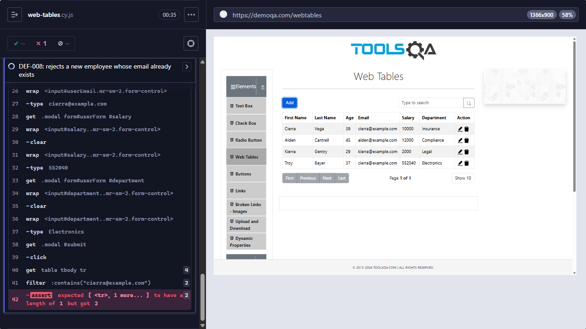

# [DEF-008] Web Tables accepts a duplicate email when adding or editing a record

**Labels:** `bug` `severity:medium` `priority:low` `area:web-tables` · **Issue:** [#8](https://github.com/felipe-haro/demoqa-cypress-automation/issues/8)

## Summary

The Web Tables registration form does not check whether an email is already in use. A new or edited employee can
use the email of another row, which leaves two rows with the same email. Email is the only field that identifies a
person in this table.

## Environment

- URL: https://demoqa.com/webtables
- Runner: Cypress 15.21.1, Electron 138 (headless), viewport 1366×900
- First observed: 2026-09-28 (exploratory probe, then `npm run test:known-defects`)

## Preconditions

A record already exists with a known email (for example the seeded `cierra@example.com`).

## Steps to reproduce

**Add path**

1. Open `https://demoqa.com/webtables`.
2. Click **Add** and fill in valid data, using the email **`cierra@example.com`**, which belongs to an existing
   record.
3. Click **Submit**.

**Edit path**

1. Open `https://demoqa.com/webtables`.
2. Click the edit icon of **Alden Cantrell** and change the email to `cierra@example.com`.
3. Click **Submit**.

## Expected result

The form stays open with a validation message such as "Email already exists", and no record is created or changed.

## Actual result

The record is saved, and the table shows **two rows** with `cierra@example.com`. This happens on both paths.

## Severity / Priority

- **Severity:** Medium. Duplicate emails make records ambiguous, so any lookup, edit or delete by email can hit the
  wrong row.
- **Priority:** Low. This is a demo table without persistence. In a real CRUD system, this would be Medium/High.

## Reproducibility

- Add path: always. The automated test failed on the recorded run of `npm run test:known-defects`.
- Edit path: reproduced in an exploratory probe on 2026-09-28 (the table showed 2 rows with `cierra@example.com`). It
  is not covered by an automated test yet.

## Evidence



- Screenshot: `docs/evidence/DEF-008-duplicate-email.png`. After a new employee is added with `cierra@example.com`,
  the table has two rows with that email. The Cypress command log shows
  `expected [ <tr>, 1 more... ] to have a length of 1 but got 2`.
- Automated check: `cypress/e2e/elements/web-tables.cy.js` → "DEF-008: rejects a new employee whose email already
  exists"
- Failure output:

```
AssertionError: Timed out retrying after 8000ms: Too many elements found. Found '2', expected '1'.
```

## Workaround

None. The form performs no uniqueness check.

## Notes / suspected cause

The form checks the format of each field (required fields, numeric age and salary, email format), but it does not
compare the email with the emails already in the table.

## Suggested fix / acceptance criteria

- [ ] Adding an employee with an email that is already in the table shows a visible validation message, and no row
      is added.
- [ ] Changing an employee's email to one used by another row is rejected in the same way.
- [ ] No two rows can have the same email after Add or Edit.
